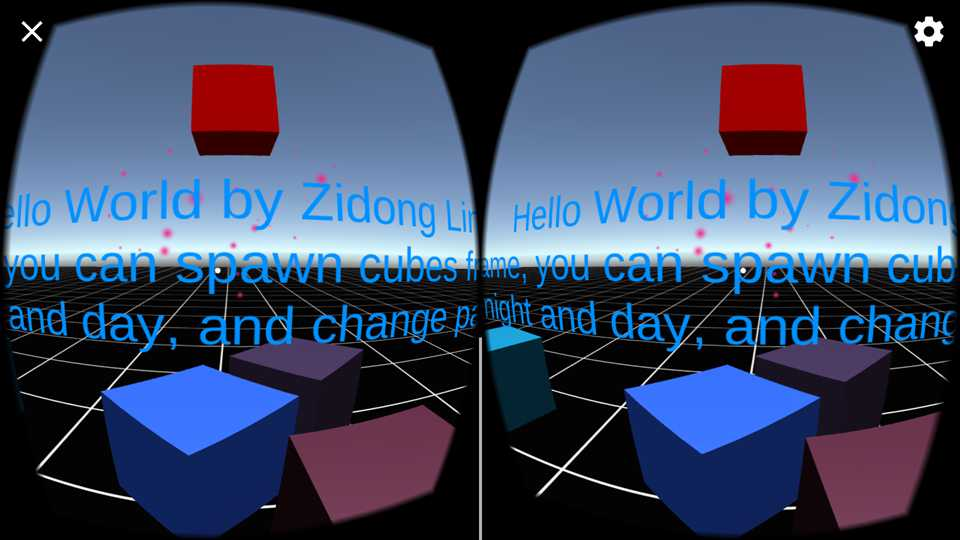

#ModifiedGoogleDemoScene

Modified from GoogleDemoScene by Udacity,  
and change some function by Zidong Lin(梓栋 林)

*****************************

###GoogleVR Support
* Google version 1.0
* License: Apache 2.0

*****************************

###File Directory
* Assets
 - /UdacityVR/Scenes/ModifiedGoogleDemoScene.unity
 - /UdacityVR/Materials
 - /UdacityVR/Prefabs
 - /UdacityVR/Scripts
* Build
 - ZidongLinFirstVR.apk
* ProjectSettings
* Screenshot
 * including 9 images
* README.md

*****************************
###V1.0.2 Features
1. Add the instructions on how to use the app
2. Adjust the text appears above the floor

###V1.0 Features
1. ToggleSun
2. ChangeParticleColor
3. SpawnRandomCubes
4. Change the Icon & ProductName

